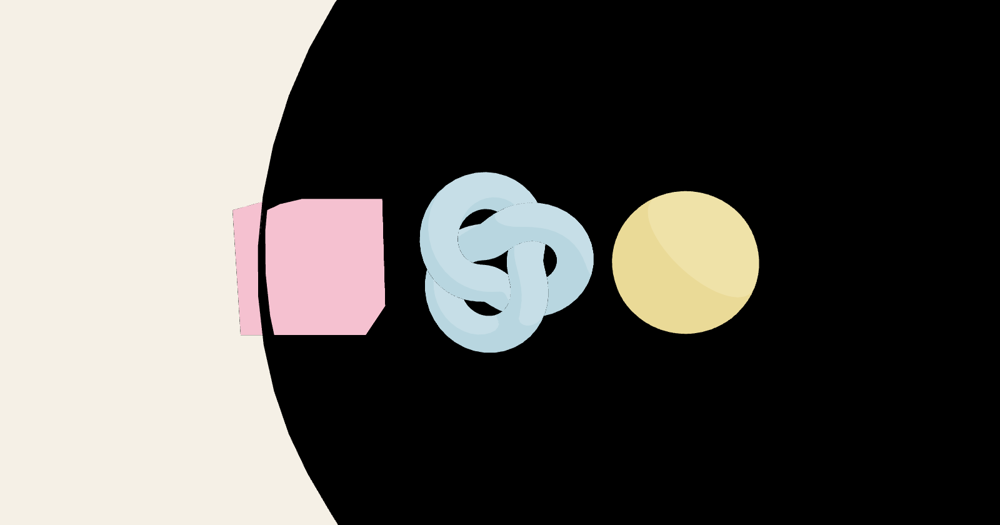
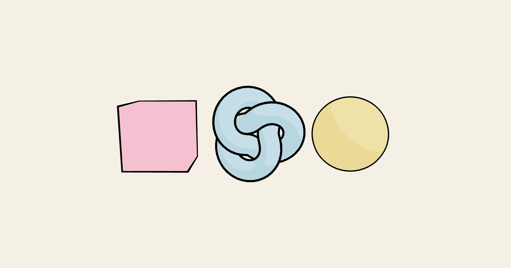

## Title

fix(Outlines): restore `screenspace` semantics

## Body

Fixes #<issue number> (and the report in #2072).

#2048 changed the `screenspace` uniform from `float` to `bool` and turned `if (screenspace == 0.0)` into `if (screenspace)`, which swapped the two branches of the vertex shader. Since 9.109.2:

- default (`screenspace={false}`): hull offset in **clip space**, so `thickness` is pixels and the documented default `0.05` draws nothing
- `screenspace`: hull offset in **world units**, so it scales with zoom, the opposite of what the prop promises

This negates the condition so the default offsets along the normals in world units again and `screenspace` gives the zoom-independent line the docs and the storybook describe.

Same scene (the docs snippet with defaults, a knot with `thickness={0.05}`, a sphere with `thickness={4} screenspace`) before and after:

| before | after |
|---|---|
|  |  |

(drag the two PNGs from the package folder into the PR description so GitHub hosts them.)
